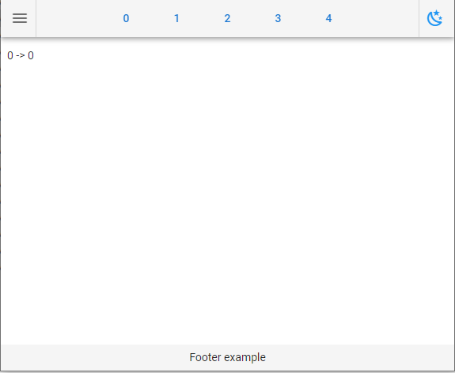
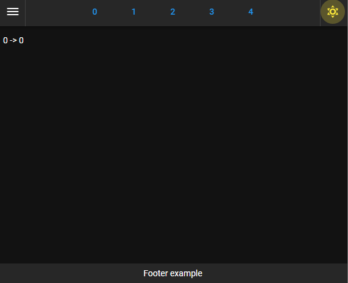
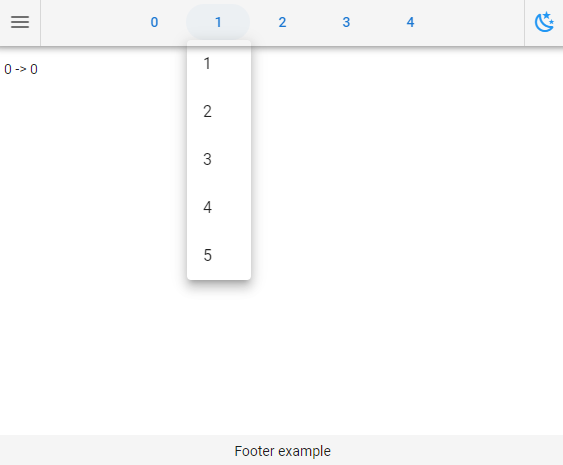
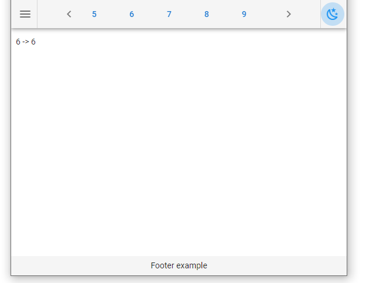

===================
ipyvuetify_app
===================

.. image:: https://img.shields.io/github/last-commit/stas-prokopiev/ipyvuetify_app
   :target: https://img.shields.io/github/last-commit/stas-prokopiev/ipyvuetify_app
   :alt: GitHub last commit

.. image:: https://img.shields.io/github/license/stas-prokopiev/ipyvuetify_app
    :target: https://github.com/stas-prokopiev/ipyvuetify_app/blob/master/LICENSE.txt
    :alt: GitHub license<space><space>

.. image:: https://img.shields.io/pypi/v/ipyvuetify_app
   :target: https://img.shields.io/pypi/v/ipyvuetify_app
   :alt: PyPI

.. image:: https://img.shields.io/pypi/pyversions/ipyvuetify_app
   :target: https://img.shields.io/pypi/pyversions/ipyvuetify_app
   :alt: PyPI - Python Version

.. contents:: **Table of Contents**

Short Overview.
=========================
ipyvuetify_app is a python package (**py>=3.7**) with a simple template for writing ipyvuetify application

Examples how your app can look like
----------------------------------------

|pic1| |pic2|

Application from the box supports theme switcher and navigation over different content by menus on top

A few more examples how header navigation works
------------------------------------------------

|pic3| |pic4|

Installation via pip:
======================

.. code-block:: bash

    pip install ipyvuetify_app

How to use it
===========================

| To create an application by the given template you need to create a routing class
| That will be in charge of what to show in the main application section
| For every selected menu item -> subitem
| Then you just give the router to **ipyvuetify_app.VueApp(...)** and it does all the magic for you

.. code-block:: python

    from ipyvuetify_app import VueApp
    from ipyvuetify_app import VueAppRouter

    vue_app_router_example = VueAppRouter()
    VueApp(vue_app_router_example)

How to write a Router
----------------------

| Every router should satisfy 2 conditions:
| 1) It has method **get_main_content(self, item, subitem)** which should return page's main content
| 2) It has attribute **self.dict_list_subitems_by_item** with all subitems for every menu item

Simple Router example
^^^^^^^^^^^^^^^^^^^^^^^^^^^^^^^

.. code-block:: python

    class VueAppRouter():

        def __init__(self):
            self.dict_list_subitems_by_item = {}
            for item in range(5):
                list_subitems = [str(subitem) for subitem in range(item, 5 + item)]
                self.dict_list_subitems_by_item[str(item)] = list_subitems

        def get_main_content(self, item, subitem):
            return f"{item} -> {subitem}"

Full VuaApp signature
----------------------

.. code-block:: python

    VueApp(
        vue_app_router,
        list_vw_fab_app_bar_left=None,
        list_vw_fab_app_bar_right=None,
        list_footer_vw_children=None,
    )

Arguments:

#. **list_vw_fab_app_bar_left**:
    | List with ipyvuetify fab icon buttons to put on the left side of Application Header Bar
#. **list_vw_fab_app_bar_right**:
    | List with ipyvuetify fab icon buttons to put on the right side of Application Header Bar
#. **list_footer_vw_children**:
    | List with ipyvuetify widgets to put in the footer
    | If empty then footer is not shown at all

VuaApp object description
--------------------------------------------

VuaApp is a child of v.App so it has all the parent methods and attributes

Useful Attributes:
^^^^^^^^^^^^^^^^^^^^^^^^^^^^^^^

#. **self.vw_appbar**:
    | v.AppBar(app=True, ...) - Application top bar
#. **self.vw_navigation_drawer**:
    | v.NavigationDrawer(app=True, ...) - Navigation Drawer at the left side
#. **self.vw_app_main**:
    | v.Content() - Main section of the application
#. **self.vw_footer**:
    | v.Footer(app=True, ...) - Footer of the application

Useful Methods:
^^^^^^^^^^^^^^^^^^^^^^^^^^^^^^^

#. **self.update_app_routing()**:
    | When router items were updated please call this method to update application menus

Links
=====

    * `PYPI <https://pypi.org/project/ipyvuetify_app/>`_
    * `GitHub <https://github.com/stas-prokopiev/ipyvuetify_app>`_

Project local Links
===================

    * `CHANGELOG <https://github.com/stas-prokopiev/ipyvuetify_app/blob/master/CHANGELOG.rst>`_.
    * `CONTRIBUTING <https://github.com/stas-prokopiev/ipyvuetify_app/blob/master/CONTRIBUTING.rst>`_.

Contacts
========

    * Email: stas.prokopiev@gmail.com
    * `vk.com <https://vk.com/stas.prokopyev>`_
    * `Facebook <https://www.facebook.com/profile.php?id=100009380530321>`_

License
=======

This project is licensed under the MIT License.